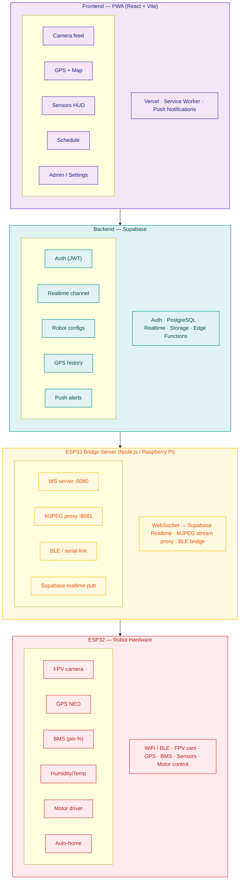

# Green Urban Robot 🤖🌿

Hệ thống điều khiển robot đô thị xanh — PWA + Supabase + ESP32

[](https://vercel.com/new/clone?repository-url=https://github.com/emyeukhoahocfpt-a1009/Green-Urban-Robot)

## Tech Stack

| Layer | Technology |
|-------|-----------|
| Frontend PWA | React 18 + Vite 5 + TypeScript |
| Backend | Supabase (Auth, DB, Realtime, Edge Functions) |
| Map | Leaflet.js |
| Push Notifications | Web Push VAPID |
| Camera Remote | Cloudflare Tunnel |
| Firmware | ESP32 Arduino (ArduinoJson, TinyGPS++) |
| Deploy | Vercel |

## Cấu trúc

```
Green_Urban_Robot/
├── .agents/workflows/   # Hướng dẫn deploy, setup
├── skills/              # Scripts: simulate-esp32, generate-vapid-keys
├── pwa/                 # React PWA (deploy Vercel)
├── supabase/functions/  # Edge Functions (telemetry, commands, notifications)
└── firmware/            # ESP32 Arduino code
```

## Sơ đồ hệ thống



### Luồng dữ liệu chính

```mermaid
graph TD
    classDef sensor fill:#e3f2fd,stroke:#2196f3,stroke-width:1px;
    classDef command fill:#f1f8e9,stroke:#8bc34a,stroke-width:1px;
    classDef alert fill:#fbe9e7,stroke:#ff5722,stroke-width:1px;

    subgraph S_Flow ["Sensor data"]
        direction LR
        S1["Sensor data<br/>ESP32 → Bridge → Supabase"] --> S2["Realtime sub<br/>Supabase → PWA (ws)"] --> S3["Dashboard update<br/>React state re-render"]
    end

    subgraph C_Flow ["Command"]
        direction LR
        C1["Command<br/>User click → Supabase"] --> C2["Edge Function<br/>Validate + relay"] --> C3["ESP32 executes<br/>WebSocket → motor"]
    end

    subgraph A_Flow ["Alerts"]
        direction LR
        A1["Pin thấp / hết giờ<br/>BMS trigger ESP32"] --> A2["Auto-home logic<br/>Bridge → Supabase alert"] --> A3["Push notification<br/>FCM → điện thoại"]
    end

    class S_Flow,S1,S2,S3 sensor;
    class C_Flow,C1,C2,C3 command;
    class A_Flow,A1,A2,A3 alert;
```



**Tech stack:** React + Vite · Supabase · Vercel · Node.js bridge · ESP32 Arduino · WebSocket · FCM · Leaflet.js  
**Auth:** Supabase Auth (email/password) · RLS policies · Admin role in profiles table  
**Camera:** MJPEG stream qua Bridge Server (ESP32 → Node.js → `` trong PWA)  
**GPS history + schedule config:** lưu Supabase · mở Google Maps qua coordinates link

---

## Tính năng

- 📷 **Camera Feed** — MJPEG stream qua Cloudflare Tunnel
- 📊 **Sensor HUD** — Battery, humidity, temp realtime
- 🗺️ **GPS Map** — Leaflet.js, trail 50 điểm, mở Google Maps
- 📡 **Connection Badge** — Online/Offline ESP32
- 📅 **Schedule Panel** — Lập lịch, auto-calc return time
- 🔔 **Push Notifications** — Web Push VAPID (pin thấp, hết giờ, offline)
- 🔐 **Auth** — Supabase email/password, RLS phân quyền admin/user

## Bắt đầu nhanh

### 1. Clone & Install
```bash
cd pwa
npm install
npm run dev
```

### 2. Giả lập ESP32 (không cần phần cứng)
```bash
# Sửa USER_ID trong file trước
node skills/simulate-esp32.js
```

### 3. Deploy
Xem `.agents/workflows/deploy.md`

### 4. Camera từ xa
1. Đảm bảo máy tính chạy PWA và phần cứng ESP32 đang kết nối **cùng một mạng WiFi**.
2. Tìm địa chỉ IP nội bộ của ESP32 (vd: `192.168.x.x`).
3. Mở Terminal và chạy lệnh thiết lập đường hầm Cloudflare Tunnel (yêu cầu cài đặt sẵn `cloudflared` bằng lệnh `winget install Cloudflare.cloudflared`):
   ```bash
   cloudflared tunnel --url http://192.168.x.x:80
   ```
4. Khi quá trình chạy thành công, một đường dẫn tạm thời sẽ được tạo ra (ví dụ: `https://abc-xyz-123.trycloudflare.com`). Bạn copy link này, đổi thành `https://abc-xyz-123.trycloudflare.com/stream`, sau đó dán vào ô **Camera Stream** tại **Dashboard** và nhấn **Lưu**.

## ESP32 Setup

Sửa `firmware/robot_firmware.ino`:
- `WIFI_SSID` / `WIFI_PASSWORD`
- `USER_ID` — UUID tài khoản Supabase

Library cần cài (Arduino Library Manager):
- ArduinoJson
- TinyGPSPlus

---
© 2025 FPT Semiconductor — NCKH EMG Signal Analysis
