# Green Urban Robot

He thong dieu khien robot do thi xanh - PWA + Supabase + ESP32

[](https://vercel.com/new/clone?repository-url=https://github.com/emyeukhoahocfpt-a1009/Green-Urban-Robot)

## Tech Stack

| Layer | Technology |
|-------|-----------|
| Frontend PWA | React 18 + Vite 5 + TypeScript |
| Backend | Supabase (Auth, DB, Realtime, Edge Functions) |
| Map | Leaflet.js |
| Push Notifications | Web Push VAPID |
| Camera Remote | Cloudflare Tunnel |
| Firmware | ESP32 Arduino (ArduinoJson, TinyGPS++) |
| Deploy | Vercel |

## Cau truc

```
Green_Urban_Robot/
|-- .agents/workflows/   # Huong dan deploy, setup
|-- skills/              # Scripts: simulate-esp32, generate-vapid-keys
|-- pwa/                 # React PWA (deploy Vercel)
|-- supabase/functions/  # Edge Functions (telemetry, commands, notifications)
`-- firmware/            # ESP32 Arduino code
```

## So do he thong

```mermaid
graph TD
    %% Global styles
    classDef frontend fill:#e8eaf6,stroke:#3f51b5,stroke-width:2px,color:#1a237e;
    classDef backend fill:#e0f2f1,stroke:#009688,stroke-width:2px,color:#004d40;
    classDef bridge fill:#fff3e0,stroke:#ff9800,stroke-width:2px,color:#e65100;
    classDef hardware fill:#ffebee,stroke:#f44336,stroke-width:2px,color:#b71c1c;

    subgraph Frontend ["Frontend - PWA (React + Vite)"]
        direction TB
        PWA["Vercel Service Worker Push Notifications"]
        subgraph F_Comp [" "]
            direction LR
            A1["Camera feed"]
            A2["GPS + Map"]
            A3["Sensors HUD"]
            A4["Schedule"]
            A5["Admin / Settings"]
        end
        PWA --- F_Comp
    end

    subgraph Backend ["Backend - Supabase"]
        direction TB
        Supa["Auth PostgreSQL Realtime Storage Edge Functions"]
        subgraph B_Comp [" "]
            direction LR
            B1["Auth (JWT)"]
            B2["Realtime channel"]
            B3["Robot configs"]
            B4["GPS history"]
            B5["Push alerts"]
        end
        Supa --- B_Comp
    end

    subgraph Bridge ["ESP32 Bridge Server (Node.js / Raspberry Pi)"]
        direction TB
        Node["WebSocket -> Supabase Realtime MJPEG stream proxy BLE bridge"]
        subgraph C_Comp [" "]
            direction LR
            C1["WS server :8080"]
            C2["MJPEG proxy :8081"]
            C3["BLE / serial link"]
            C4["Supabase realtime pub"]
        end
        Node --- C_Comp
    end

    subgraph Hardware ["ESP32 - Robot Hardware"]
        direction TB
        ESP["WiFi / BLE FPV cam GPS BMS Sensors Motor control"]
        subgraph D_Comp [" "]
            direction LR
            D1["FPV camera"]
            D2["GPS NEO"]
            D3["BMS (pin %)"]
            D4["Humidity/Temp"]
            D5["Motor driver"]
            D6["Auto-home"]
        end
        ESP --- D_Comp
    end

    Frontend --> Backend
    Backend --> Bridge
    Bridge --> Hardware

    class Frontend,PWA,A1,A2,A3,A4,A5 frontend;
    class Backend,Supa,B1,B2,B3,B4,B5 backend;
    class Bridge,Node,C1,C2,C3,C4 bridge;
    class Hardware,ESP,D1,D2,D3,D4,D5,D6 hardware;
```



### Luong du lieu chinh

```mermaid
graph TD
    subgraph S_Flow ["Sensor Data"]
        S1[ESP32] --> S2[Bridge] --> S3[Supabase] --> S4[Realtime sub] --> S5[Dashboard update]
    end

    subgraph C_Flow ["Command"]
        C1[User click] --> C2[Supabase] --> C3[Edge Function] --> C4[ESP32 executes]
    end

    subgraph A_Flow ["Alerts"]
        A1[BMS trigger ESP32] --> A2[Auto-home logic] --> A3[Push notification]
    end

    classDef sensor fill:#e3f2fd,stroke:#2196f3,stroke-width:1px;
    classDef command fill:#f1f8e9,stroke:#8bc34a,stroke-width:1px;
    classDef alert fill:#fbe9e7,stroke:#ff5722,stroke-width:1px;

    class S1,S2,S3,S4,S5 sensor;
    class C1,C2,C3,C4 command;
    class A1,A2,A3 alert;
```



## Tinh nang

- Camera Feed - MJPEG stream qua Cloudflare Tunnel
- - Sensor HUD - Battery, humidity, temp realtime
  - - GPS Map - Leaflet.js, trail 50 diem, mo Google Maps
    - - Connection Badge - Online/Offline ESP32
      - - Schedule Panel - Lap lich, auto-calc return time
        - - Push Notifications - Web Push VAPID (pin thap, het gio, offline)
          - - Auth - Supabase email/password, RLS phan quyen admin/user
           
            - ## Bat dau nhanh
           
            - ### 1. Clone & Install
            - ```bash
              cd pwa
              npm install
              npm run dev
              ```

              ### 2. Gia lap ESP32 (khong can phan cung)
              ```bash
              # Sua USER_ID trong file truoc
              node skills/simulate-esp32.js
              ```

              ### 3. Deploy
              Xem .agents/workflows/deploy.md

              ### 4. Camera tu xa
              Xem .agents/workflows/cloudflare-tunnel.md

              ## ESP32 Setup

              Sua firmware/robot_firmware.ino:
              - WIFI_SSID / WIFI_PASSWORD
              - - USER_ID - UUID tai khoan Supabase
               
                - Library can cai (Arduino Library Manager):
                - - ArduinoJson
                  - - TinyGPSPlus
                   
                    - ---
                    (c) 2025 FPT Semiconductor - NCKH EMG Signal Analysis
                    
